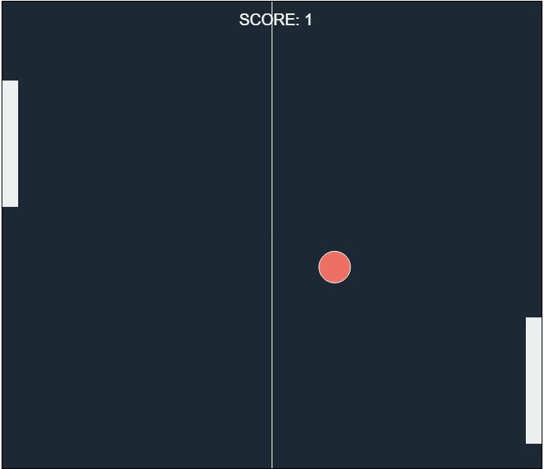

# Ping_pong

Ping Pong game 

## Features
This game uses html5 and canvas api to create a ping-pong like game. It makes use of the keyboard arrow keys to control the paddles.

## Implementation
In index.js, all logic for creating and moving the ball and player's paddle is held .
It contains logic for : 
* Shifting player's paddles according to their turn.
* Moving the ball in random directions.
* Tracking the score
* Conditions for Game Over and determining which player loses.

## Technology
 
 * HTML5
 * Canvas API
 * CSS

